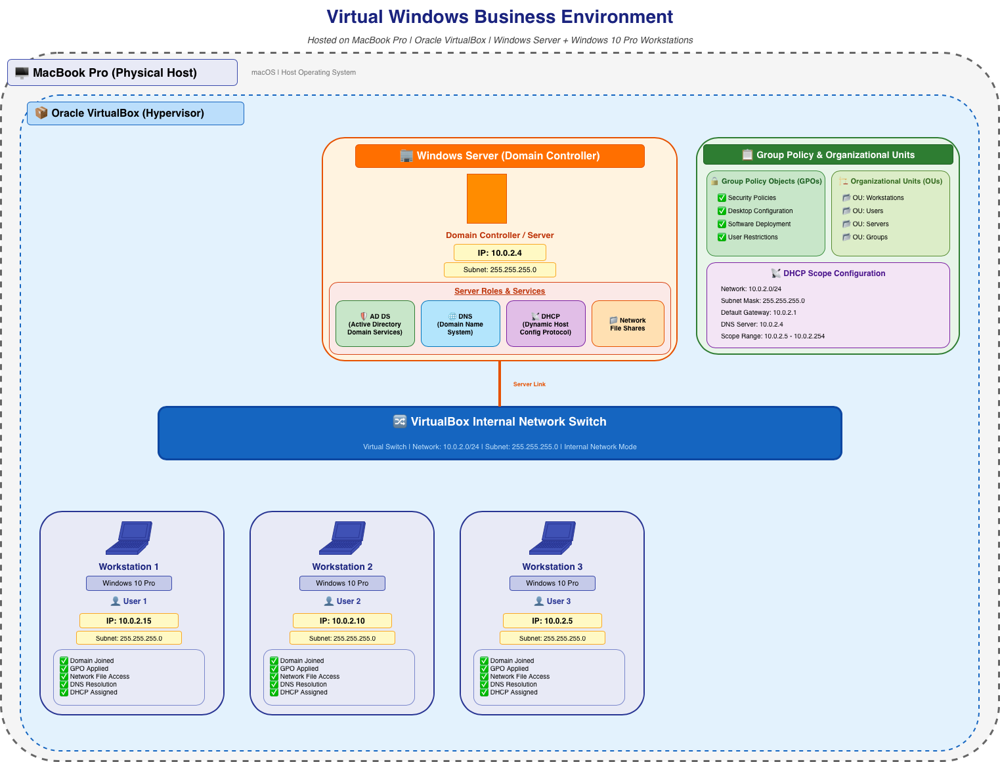
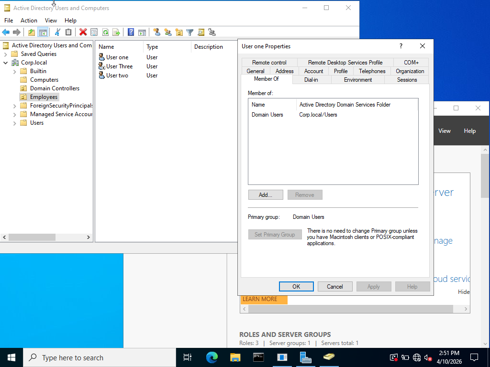
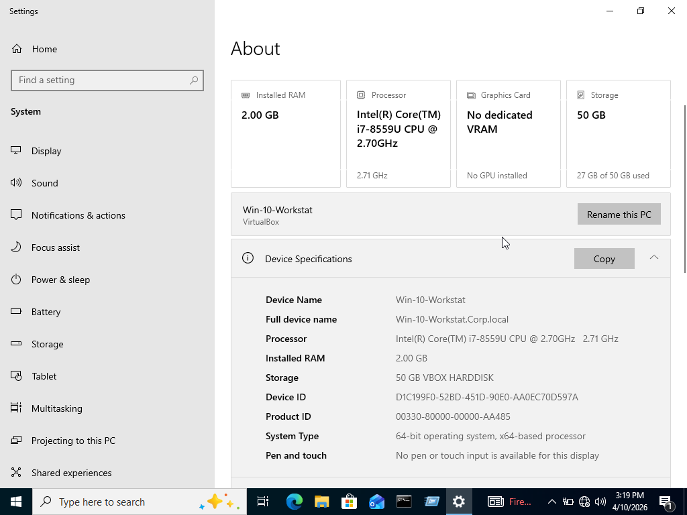

markdown
# Windows Active Directory Home Lab

## Overview
A fully functional enterprise-level environment virtualized on macOS. This project demonstrates my ability to configure core networking services, manage Active Directory Domain Services (AD DS), and document infrastructure architecture.

## Network Topology

## Core Technologies
- **Hypervisor:** VirtualBox (macOS Host)
- **Networking:** Virtual NAT Gateway, Virtual Layer 2 Switch
- **Environment:** Windows Server 2022 & Windows 10 Business

## Configurations Documented
- **Active Directory:** Established a forest root domain (corp.local).
- **DNS/DHCP:** Configured the DC as the primary DNS resolver for the internal subnet.
- **User Management:** Created OUs for Users and Computers; implemented standardized naming conventions.
- **Security:** Perimeter Firewall configuration with NAT for internet breakout.

## Lab Evidence
### Active Directory Configuration

### Successful Domain Join

